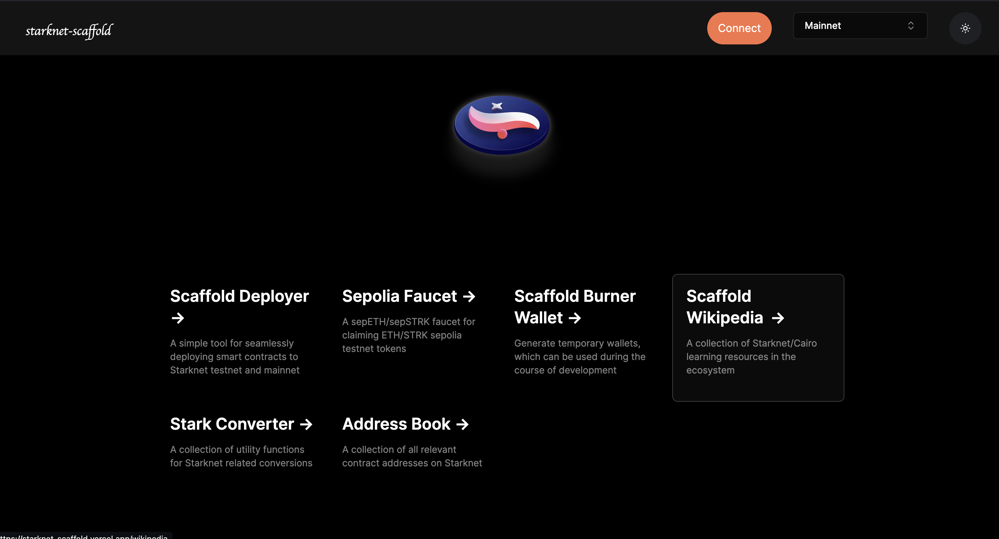

# Environment

## Getting Started

After setting up your project, follow these steps to get your development environment running smoothly:

1. Install the required dependencies
   
   Navigate to your project directory and install the required dependencies:

   ```
   cd my-app
   ```

   ```
   npm run install
   ```

   This will download and install all the important packages specified in the `package.json` file, including Scarb, Starknet Foundry and dojo if not initially present.

   **PS:** This is only necessary if you installed by cloning. All these are done automatically when you use the `create-starknet-app` executable.

2. To build your Cairo contracts:

   ```
   npm run build-contracts
   ```

3. To start your development server, run:
   
   ```
   npm run start
   ```

   This command kickstarts a local development server for your new project.

Starknet-Scaffold provides other scripts to facilitate development. We will cover more of these available scripts in the coming chapters.



You now have a fully set up and running installation of Starknet-Scaffold at `https://localhost:3000`. For further customization and detailed instructions, please refer to the documentation.