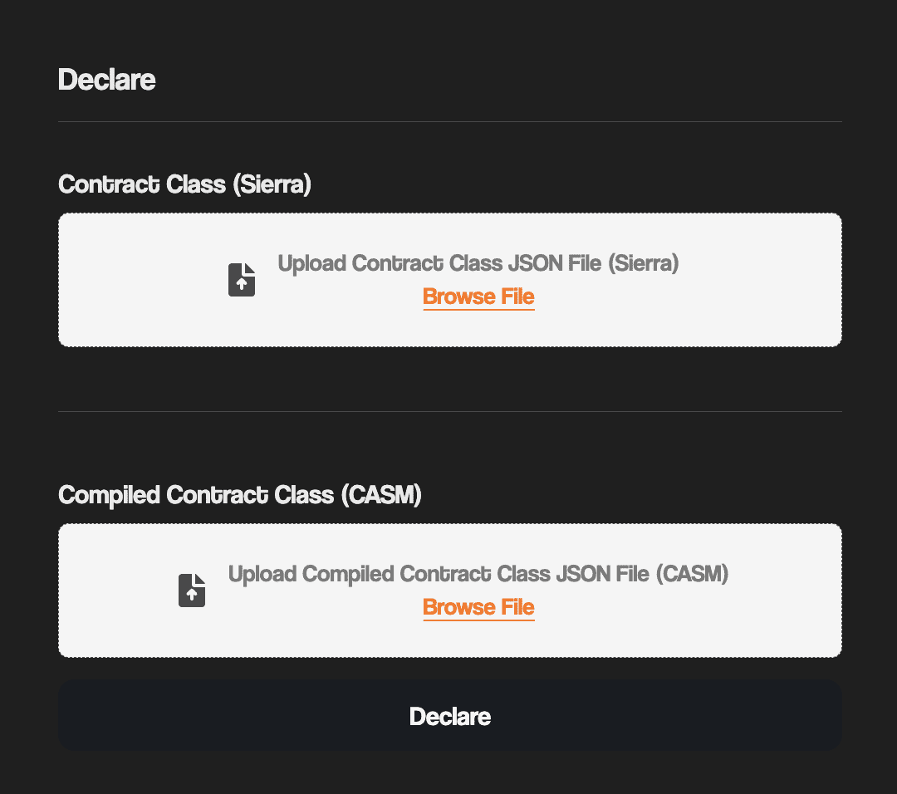
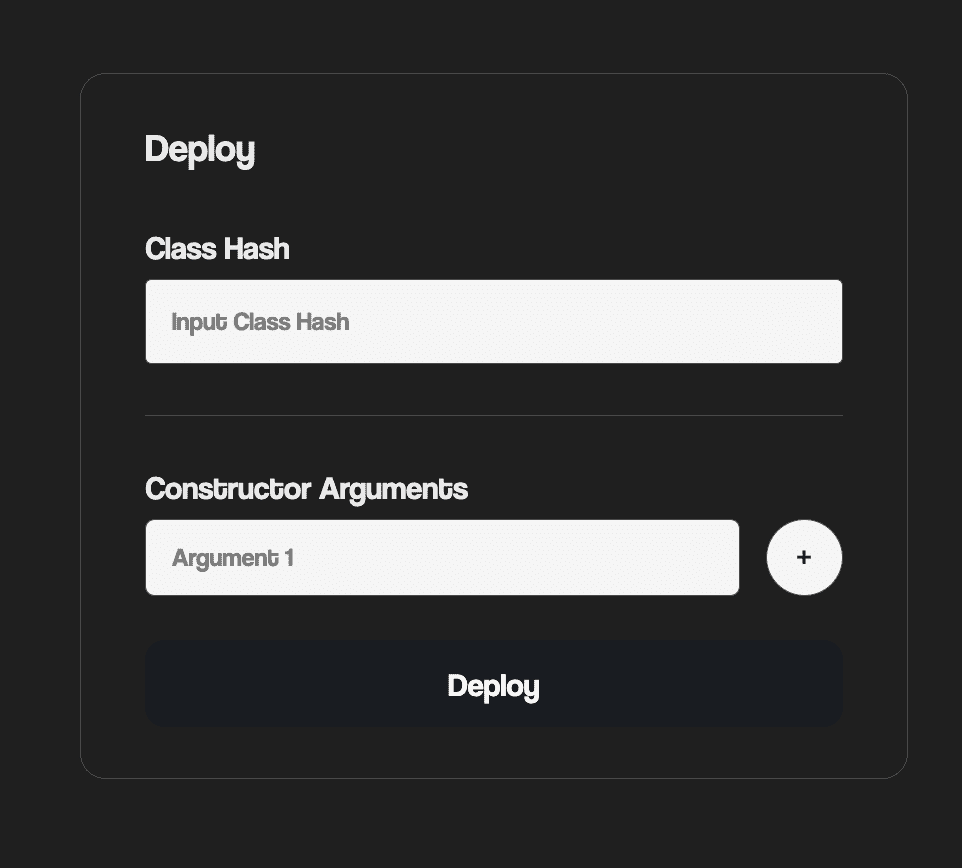

# Deployer

The scaffold deployer is a simple tool for seamlessly declaring and deploying smart contracts to Starknet testnet and mainnet.

This tools interface consists of two sections; the declare and deploy section.

## Declare section

This section takes in the Contract Class JSON file (Sierra) and the Compiled Contract Class JSON file (CASM), then declares the contract.
Once declared, a class hash is returned which can be used to deploy the contract.

## Deploy section

This section takes in the declared class hash and its constructor arguments, then deploys the contract.

