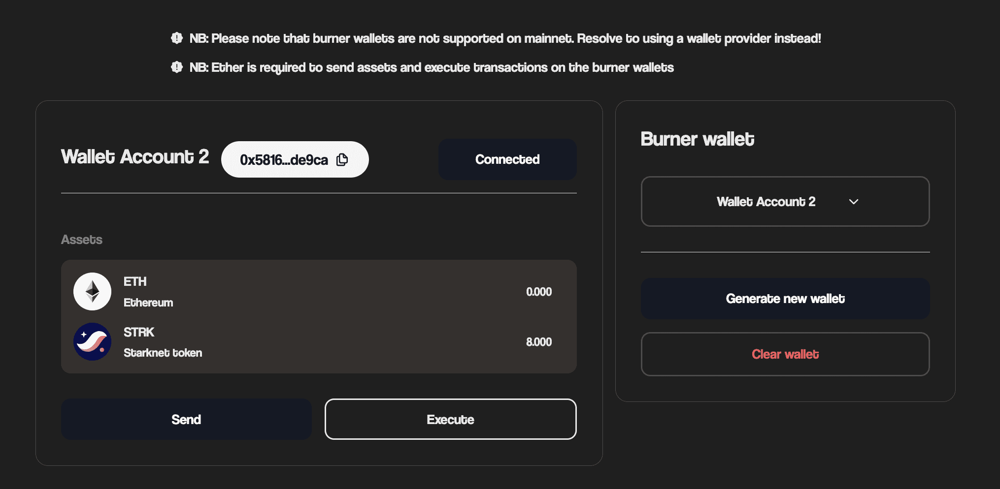

# Burner Wallet

The Burner wallet tool enables users to generate temporary wallets for use during the course of development. Burner wallets are only supported on the Sepolia network and a user can only generate a maximum of five wallets at a time.

A generated wallet UI gives us information such as ETH and STRK balance and address. The burner wallet can be funded using the [Faucet](subchapter_3.md) tool.

In order for the generated burner wallet to be used, it has to be connected. After connection, the user can use it for the following;

1. Transfer of tokens(ETH/STRK):
   Transfer tokens by inputting the recipient address and amount.

2. Execute smart contract calls:
   Execute functions from other smart contracts by inputting the contract address, function name and arguments.

Users have the ability to also clear the generated wallets.

