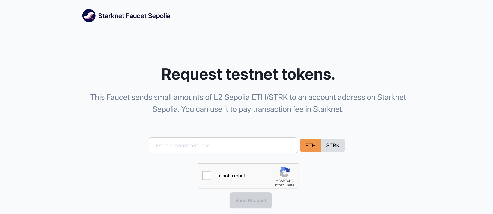

# Faucet

This is a sepETH/sepSTRK faucet tool built by the Starknet Foundation.
You can claim ETH/STRK sepolia testnet tokens for development. This tool can be used to fund generated burner wallets.

