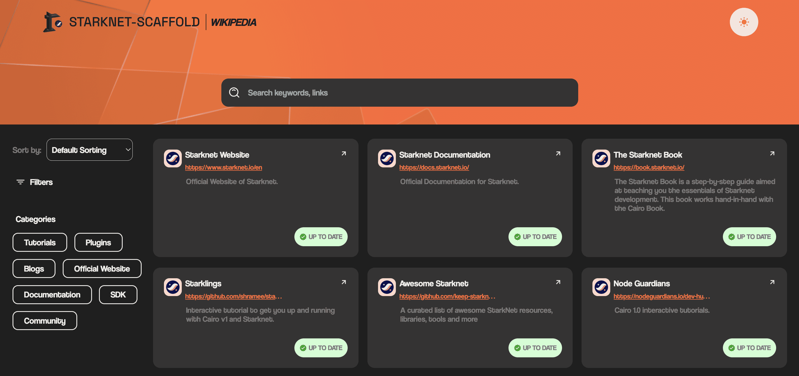

# Wikipedia

The Wikipedia is a collection of Starknet/Cairo learning resources within the ecosystem.

The columns of the table are:

- Name: The name of the resource.
- Description: A short description of the mentioned tool.
- Status: Indicates whether the tool/resource is up-to-date or not.
- URL: A link to the tool/resource.

This tool also includes a search functionality to easily find resources.

